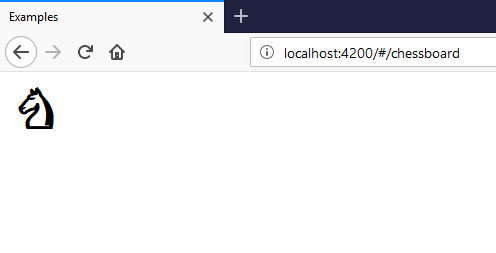
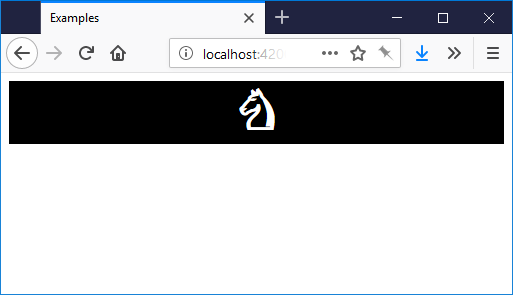
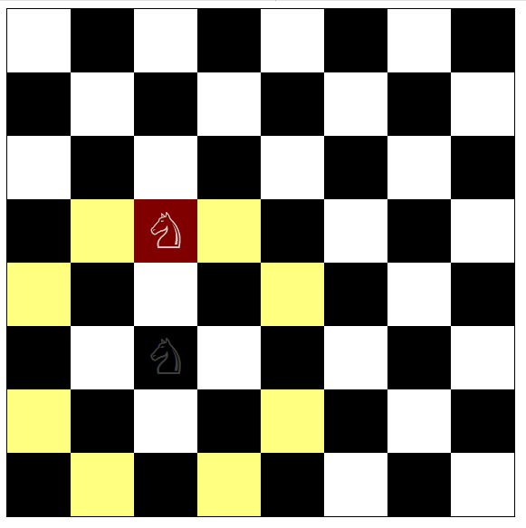
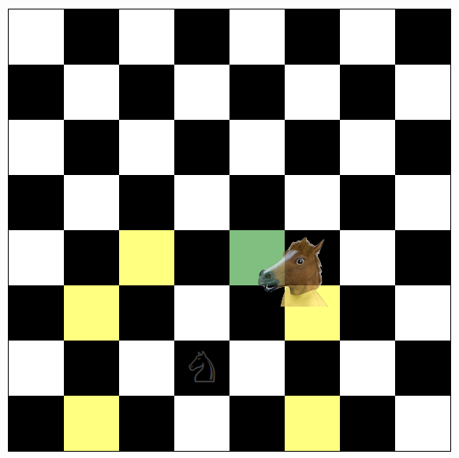

# Chess Tutorial

In this tutorial, we're building a tiny chess game, with one knight on the
board. It's an Angular-specific translation of the original [`react-dnd`
tutorial][orig]. The discussion about how to break down this game into
components is worth reading the original for. We will carry on implementing the
three components:

* `KnightComponent`, responsible for rendering one knight piece
* `SquareComponent`, just one black or white square on the board
* `BoardComponent`, 64 squares.

[orig]: http://react-dnd.github.io/react-dnd/docs-tutorial.html

This tutorial assumes you are familiar with the basics of Angular (version 2+).
It also assumes you have read the [Quickstart](./quickstart.html) guide, and have attached the
`SkyhookDndModule` *and* the HTML5 backend. Complete source code is available on
GitHub, in four commits: [one][chessboard-1], [two][chessboard-2],
[three][chessboard-3], [four][chessboard-4], the last of which is the finished
product. You can play with a [live demo](../examples/index.html#/chessboard).

[chessboard-1]: https://github.com/cormacrelf/angular-skyhook/tree/chessboard-1/packages/examples/src/app/chessboard
[chessboard-2]: https://github.com/cormacrelf/angular-skyhook/tree/chessboard-2/packages/examples/src/app/chessboard
[chessboard-3]: https://github.com/cormacrelf/angular-skyhook/tree/chessboard-3/packages/examples/src/app/chessboard
[chessboard-4]: https://github.com/cormacrelf/angular-skyhook/tree/chessboard-4/packages/examples/src/app/chessboard

## Basic chess visuals

We'll build the `KnightComponent` first. It is very simple, just a span with a Unicode
knight character in it.

```typescript
import { Component } from '@angular/core';

@Component({
    selector: 'app-knight',
    template: `<span>♘</span>`,
    styles: [`
    span {
        font-weight: 400;
        font-size: 54px;
        line-height: 70px;
    }
    `]
})
export class KnightComponent {
}
```

Add this component to your module's `declarations` section, and put
`<app-knight></app-knight>` somewhere on your page.



Next, we will implement `SquareComponent`. It is responsible only for changing the colour
of the background and foreground depending on a `black` input, and rendering
whatever was passed to it inside its tags. Make a `SquareComponent`, add it to
your module, and include the following very simple HTML template:

```html
<div [ngStyle]="getStyle()">
  <ng-content></ng-content>
</div>
```

In the body of the component class, add an input for whether the square should
be black or not:

```typescript
@Input() black: boolean;
```

Then implement `getStyle()` by reading this property.


```typescript
getStyle() {
    return this.black
        ? { backgroundColor: 'black', color: 'white' }
        : { backgroundColor: 'white', color: 'black' }
}
```

Note that by attaching these styles directly via `[ngStyle]`, they are not
affected by Angular's view encapsulation, so `color` will apply to any child
components as well. You could achieve the same by using classes and CSS and
`::ng-deep` or turning view encapsulation off, but `[ngStyle]` is good enough
for us.

Then, we want `SquareComponent` to take up all the space available to it. This
way, Square can be arbitrarily large, and we don't have to be concerned with how
big the whole board is going to be. Include the following in a `styles` block,
or a linked CSS file.

```css
:host, div {
    display: block;
    height: 100%;
    width: 100%;
    text-align: center;
}
```

At this point, you can render one square with a knight in it, like so:

```html
<app-square [black]="true">
    <app-knight></app-knight>
</app-square>
```




If you're paying attention, you'll notice that `height: 100%` doesn't really
mean anything as none of the parent `div`s have a height to be 100% of, but it
will make sense later when we put the Square in a `div` that has an absolute
height.

Then, let's build the board. Start by building out a component that just renders
one square.

```typescript
import { Component } from '@angular/core';

@Component({
    selector: 'app-board',
    template: `
    <div>
        <app-square [black]="true">
            <app-knight></app-knight>
        </app-square>
    </div>
    `
})
export class BoardComponent {
}
```

Now, we need to render 64 of them. We will need an `*ngFor`, but Angular isn't
very good at for loops, so we have to make an array of 64 items.


```html
<div *ngFor="let i of sixtyFour">
    <app-square [black]="true">
        <app-knight></app-knight>
    </app-square>
</div>
```

```typescript
// ...
export class BoardComponent {
    sixtyFour = new Array(64).fill(0).map((_, i) => i);
}
```


Then, you just have a lot of black squares in a vertical list. Not very chess-y.
To make it an 8x8 grid, we are going to wrap them all in a `<div
class="board">`, and use the cool new CSS feature, CSS Grid. Make sure you are
using a modern browser. Apply this style to the wrapping `.board`:

```css
.board {
    width: 100%;
    height: 100%;
    border: 1px solid black;
    display: grid;
    grid-template-columns: repeat(8, 12.5%);
    grid-template-rows: repeat(8, 12.5%);
}
```

For brevity's sake you could just set `.board` to a fixed `width` and `height`
of `560px`. I added a `ContainerComponent`, just to specify that size, to keep
the board independent of where it will be placed. At this point, you will have
an 8x8 board, but it still doesn't *quite* look like chess.


### Making the chessboard pattern and placing one knight on the board

We're going to need a way to express coordinates on the board. Define a new
interface, to hold `x` and `y` coordinates.

```typescript
export interface Coord {
  x: number;
  y: number;
}
```

Save it in a new file, `coord.ts`, and import it into your Board component file.
Then, we need to convert `[0..63]` (the indices of the `*ngFor`) to `Coord`
objects.

```
export class Board {
    // ...
    xy(i): Coord {
      return {
          x: i % 8,
          y: Math.floor(i / 8)
      }
    }
}

```

You can then quite easily go from `Coord` to whether the square is black or not:

```typescript
    // ...
    isBlack({ x, y }: Coord) {
        return (x + y) % 2 === 1;
    }
```

Then, pass the result to each `SquareComponent`, and render only one `KnightComponent` in the top
left:

```html
<div *ngFor="let i of sixtyFour">
    <app-square *ngIf="xy(i) as pos" [black]="isBlack(pos)">
        <app-knight *ngIf="pos.x === 0 && pos.y === 0"></app-knight>
    </app-square>
</div>
```

And look at that, we have a chess board with one knight.


## Making the knight move around

> At this point, your code should look like [this commit][chessboard-1]. You can
> start fresh from there if you want.

We can clearly represent the position of a knight in one `Coord` object. You
*could* store this on the `BoardComponent` itself:

```html
<app-knight *ngIf="pos.x === knightPosition.x && pos.y === knightPosition.y">
</app-knight>
```

```typescript
knightPosition: Coord = { x: 2, y: 5 };
```

But we're going to want to read this elsewhere and drive the game logic from it,
and we don't want all the game logic to be trapped inside the `BoardComponent`.

So, create a `GameService`, and represent the changing position of the knight
with an RxJS `BehaviorSubject<Coord>`. This is an ultra-lightweight way of
building an `@ngrx`-style Store without any boilerplate. It allows us to
'broadcast' updates to the knight's position to any interested components.

Like any `Subject`, `BehaviourSubject` can be used as an `Observable`, and
components can subscribe to it with the `| async` pipe. But unlike a regular
`Subject`, it can also have an initial value, and will replay the most recent
value to any new subscribers. This is exactly what we want.

```typescript
import { Injectable } from '@angular/core';
import { BehaviorSubject } from 'rxjs';
import { Coord } from './coord';

@Injectable()
export class GameService {

    knightPosition$ = new BehaviorSubject<Coord>({ x: 2, y: 5 });

    moveKnight(to: Coord) {
        this.knightPosition$.next(to);
    }

}
```

As you can see, this is a very simple service. Inject it into your
`BoardComponent`, and let's put the Knight where the `GameService`
says it should go.

```html
<app-knight *ngIf="pos.x === (knightPosition$|async).x && pos.y === (knightPosition$|async).y">
</app-knight>
```

```typescript
knightPosition$ = this.game.knightPosition$;
constructor(private game: GameService) { }
```

This works, but it's very hard to read. A better solution would be to put the
entire `*ngFor` section in the scope of one subscription. You can do that
without introducing a redundant `<div>`, by using `<ng-container>` and a fancy
trick: since `knightPosition$|async` is always [truthy][truthy], you can put it in an
`*ngIf` and give the result a name using the `*ngIf="AAA as BBB"` syntax. Here's
the entire template:

[truthy]: https://developer.mozilla.org/en-US/docs/Glossary/Truthy

```html
    <div class="board">
        <ng-container *ngIf="knightPosition$|async as kp">
            <div class="square-container" *ngFor="let i of sixtyFour">
                <app-square *ngIf="xy(i) as pos" [black]="isBlack(pos)">
                    <app-knight *ngIf="pos.x === kp.x && pos.y === kp.y">
                    </app-knight>
                </app-square>
            </div>
        </ng-container>
    </div>
```

The resulting template is much clearer.

Now that we have a `knightPosition$` and even a `GameService.moveKnight()`
function, we can hook up a click event on each `<app-square>` to move the knight
around the board. We're going to remove it later, so just throw it in the
`BoardComponent`:

```html
<app-square *ngIf="xy(i) as pos" [black]="isBlack(pos)" (click)="handleSquareClick(pos)">
```

```typescript
handleSquareClick(pos: Coord) {
    this.game.moveKnight(pos);
}
```

Click around, and your noble `KnightComponent` will follow, even though he is breaking
the rules. So, let's add the rules. Amend the `GameService` to include
a `canMoveKnight` function, based on the current position and a prospective
position. You can store the `currentPosition` by subscribing internally to
`knightPosition$` and writing out each new value into an instance variable.

```typescript
import { Injectable } from '@angular/core';
import { BehaviorSubject } from 'rxjs';
import { Coord } from './coord';

@Injectable()
export class GameService {

    knightPosition$ = new BehaviorSubject<Coord>({ x: 2, y: 5 });
    currentPosition: Coord;

    constructor() {
        this.knightPosition$.subscribe(kp => {
            this.currentPosition = kp;
        })
    }

    moveKnight(to: Coord) {
        this.knightPosition$.next(to);
    }

    canMoveKnight(to: Coord) {
        const { x, y } = this.currentPosition;
        const dx = to.x - x;
        const dy = to.y - y;

        return (Math.abs(dx) === 2 && Math.abs(dy) === 1) ||
               (Math.abs(dx) === 1 && Math.abs(dy) === 2);
    }

}
```

Amend `handleSquareClick` to check the rules before executing the move:

```typescript
handleSquareClick(pos: Coord) {
    if (this.game.canMoveKnight(pos)) {
        this.game.moveKnight(pos);
    }
}
```

And voilà, your knight won't execute an illegal move. We will be replacing this
click handler in just a moment, but we have separated the game logic out, so we
can reuse those two functions.

## Implementing drag and drop

> At this point, your code should be look like [this commit][chessboard-2].

Take a moment to think about what we have to work with. We have:

* A `KnightComponent` which we want to be able to drag,
* Many `SquareComponent`s on which he could be dropped,
* A way to express that state change (`GameService.moveKnight`),
* And a way to compute where we can drop him (`GameService.canMoveKnight`).

Our strategy for implementing drag and drop is this:

1. Make the knight draggable
2. Turn all the squares into drop targets
3. Only allow drops into squares where `canMoveKnight` returns `true`
4. On each successful drop, call `moveKnight`, and Angular will re-render with
   the new state.
5. Add some extra visuals to guide the interaction

If you have used other drag and drop libraries, this may seem a bit weird --
what happens to the Knight that we're dragging after we drop him? The answer is,
he disappears. After step 1, we will have a knight you can pick up, but nothing
interesting will happen when we let go, except that the preview will vanish. We
are going to do steps 3 and 4 on the drop targets, which are notified when you
drop something on them.

### Part 1. Make the knight draggable

First, we need a type to describe what we're dragging, so that the squares can
listen for knights floating above them. Store a constant string `"KNIGHT"` in
a new file. This is better than typing the same string over and over, and serves
as a single place where all your different chess piece types are defined.

```typescript
// constants.ts
export const ItemTypes = {
    KNIGHT: "KNIGHT"
}
```

Then, make your `KnightComponent` into a drag source.

1. Inject `SkyhookDndService` into your `KnightComponent`
2. Create a dead simple drag source which emits `ItemTypes.KNIGHT`, and a simple
   `{}` to represent what's being dragged. We don't need any more information
   than that, but if you were doing >1 piece, you would have to specify _which
   knight_ was being dragged. This is where you'd do it.
3. Attach the drag source to the Knight's DOM element.
4. In `ngOnDestroy`, unsubscribe the drag source.

Here's all four in one go:

```typescript
import { Component } from '@angular/core';
import { SkyhookDndService } from "@angular-skyhook/core";
import { ItemTypes } from './constants';

@Component({
    selector: 'app-knight',
                     // step 3
    template: `<span [dragSource]="knightSource">♘</span>`,
    styles: [`
    span {
        font-weight: 700;
        font-size: 54px;
    }
    `]
})
export class KnightComponent {
    // step 2
    knightSource = this.dnd.dragSource(ItemTypes.KNIGHT, {
        beginDrag: () => ({})
    });

    // step 1
    constructor(private dnd: SkyhookDndService) { }

    // step 4
    ngOnDestroy() {
        this.knightSource.unsubscribe();
    }
}
```

Try dragging your little knight, and you'll find that you can. But the
interaction is slightly confusing - you can't tell at a glance that the knight
is conceptually in-flight, it just looks like there are two knights. So let's
listen to whether we are dragging the knight, and make the stationary one look
different while we are.

1. Use the `DragSource.listen` and `DragSourceMonitor.isDragging` methods to
   get an observable `isDragging$` on your `KnightComponent`.
2. Use that observable in your template to change styles

```typescript
// component
// (this is an Observable<boolean>)
isDragging$ = this.knightSource.listen(monitor => monitor.isDragging());
```

```html
<!-- template -->
<span [dragSource]="knightSource" [class.dragging]="isDragging$|async">♘</span>
```

```css
/* in the style block */
.dragging {
    opacity: 0.25;
}
```

Now, the knight on the board will be a bit transparent when you've picked it up.
You could set it to `opacity: 0`, but in chess, players like to know where the
piece came from. `@angular-skyhook` makes no assumptions about how to render
any elements, so you can always customise their appearance at any stage of the
drag and drop process.


### Part 2: Make the squares into drop targets

Because `canMoveKnight` has to be computed once per square, each square is going
to have to know where it is on the board. However, the `SquareComponent` is
perfectly good at what it does. We don't want to ruin a good thing. Let's wrap
it with another component, `BoardSquareComponent`, that will handle the drag and drop,
and leave the black and white rendering to `SquareComponent`. This is a basic wrapper
which preserves the size of the underlying squares:

```typescript
import { Component, Input  } from "@angular/core";

@Component({
    selector: 'app-board-square',
    template: `
    <div class="wrapper">
        <app-square [black]="black">
            <ng-content></ng-content>
        </app-square>
    </div>
    `, styles: [`
    :host, .wrapper {
        display: block;
        position: relative;
        width: 100%;
        height: 100%;
    }
    `]
})
export class BoardSquareComponent {
    @Input() position: Coord;
    get black() {
         const { x, y } = this.position;
         return (x + y) % 2 === 1;
    }
}
```

Add it to your module, and replace the `<app-square>` in the `BoardComponent`
template with this:

```html
<app-board-square *ngIf="xy(i) as pos" [position]="pos">
    <app-knight *ngIf="pos.x === kp.x && pos.y === kp.y"></app-knight>
</app-board-square>
```

Then, we're going to add a drop target to `BoardSquareComponent` and attach it
to that wrapper `div`. It's very similar to the drag source.

1. Inject `SkyhookDndService`
2. Create a drop target
3. Attach it to the DOM
4. Unsubscribe it in `ngOnDestroy`.


```typescript
import { Component, Input  } from "@angular/core";
import { SkyhookDndService } from "@angular-skyhook/core";
import { ItemTypes } from "./constants";

@Component({
    selector: 'app-board-square',
    template: `
                         <!-- step 3 -->
    <div class="wrapper" [dropTarget]="target">
        <app-square [black]="black">
            <ng-content></ng-content>
        </app-square>
    </div>
    `, styles: [`
    :host, .wrapper {
        display: block;
        position: relative;
        width: 100%;
        height: 100%;
    }
    `]
})
export class BoardSquareComponent {
    @Input() position: Coord;
    get black() {
         const { x, y } = this.position;
         return (x + y) % 2 === 1;
    }

    // step 2
    target = this.dnd.dropTarget(ItemTypes.KNIGHT, {

    });

    // step 1
    constructor(private dnd: SkyhookDndService) { }

    // step 4
    ngOnDestroy() {
        this.target.unsubscribe();
    }

}
```

### Parts 3 and 4: make the knight move around on drop

Next up is to incorporate the game logic, and to actually move the knight. We're
going to use two hooks in the drop target: `DropTargetSpec.canDrop` and
`DropTargetSpec.drop`. We have already done the heavy lifting for both in
`GameService`. Inject `GameService` in the constructor, and incorporate its
methods.


```typescript
target = this.dnd.dropTarget(ItemTypes.KNIGHT, {
    canDrop: monitor => {
        return this.game.canMoveKnight(this.position);
    },
    drop: monitor => {
        this.game.moveKnight(this.position);
    }
});

constructor(private dnd: SkyhookDndService, private gme: GameService) {}
```

Now you should be able to drag your knight around the board!

### Part 5: Extra visuals

We have some guidance already about where you can drop a knight. The mouse
cursor gets a different icon depending on whether you can or not. But usually,
this is not enough of an indicator. Good UI means making difficult things
obvious and learnable. Someone who has never seen a knight should be able to
figure out where one can go.

In that spirit, we will change the colour of the squares while dragging,
depending on whether they represent a valid move, and colour the square you're
hovering over either red or green depending on whether dropping would result in
a move.

The procedure is almost identical to what we did for the Knight earlier on.

1. Use the `DropTarget.listen`, `DropTargetMonitor.canDrop` and
   `DropTargetMonitor.isOver` methods to observe changes in drag state
2. Use observables in your template to change styles on an overlay `div`.

```typescript
// We are assuming RxJS 5.5+ here, but you can use plain Observable.map
import { map } from 'rxjs/operators';

// template:
```

```html
    <div class="wrapper" [dropTarget]="target">
        <app-square [black]="black">
            <ng-content></ng-content>
        </app-square>
        <div class="overlay"
             *ngIf="showOverlay$|async"
             [ngStyle]="overlayStyle$|async"></div>
    </div>

```

```typescript
export class BoardSquareComponent {
    // ...
    target = this.dnd.dropTarget(ItemTypes.KNIGHT, {
        // ...
    });

    collected$ = this.target.listen(m => ({
        canDrop: m.canDrop(),
        isOver: m.isOver(),
    }));
    
    showOverlay$ = this.collected$.pipe(map(c => c.isOver || c.canDrop));

    overlayStyle$ = this.collected$.pipe(map(coll => {
        let { canDrop, isOver } = coll;
        let bg: string = "rgba(0,0,0,0)";
        if (canDrop && isOver) { bg = 'green'; }
        else if (canDrop && !isOver) { bg = 'yellow'; }
        else if (!canDrop && isOver) { bg = 'red'; }
        return {
            position: 'absolute',
            top: 0,
            left: 0,
            height: '100%',
            width: '100%',
            zIndex: 1,
            opacity: 0.5,
            backgroundColor: bg
        }
    }));

    // ...

}
```

Here's what it looks like:



Lastly, we're going to customize the drag preview (that little knight that
follows the mouse around). `@angular-skyhook` has some very powerful ways to
customize this, but we're going to use a simple image. It's quite simple:

1. Create an [`Image`](https://developer.mozilla.org/en-US/docs/Web/API/HTMLImageElement/Image)
2. Wait for it to load
3. Connect it to the `knightSource` as a drag preview

We can do this in just a few lines.

```typescript
// ...
export class KnightComponent {
    // ...

    ngOnInit() {
        const img = new Image();
        img.src = // ... long 'data:image/png;base64' url
                  // regular 'https://' URLs work here too
        img.onload = () => this.knightSource.connectDragPreview(img);
    }
}
```

For that long URL, see [this file](https://github.com/cormacrelf/angular-skyhook/blob/chessboard-4/packages/examples/src/app/chessboard/horseImage.ts).

Then we get a funky horse as our preview.



Have a go with the live demo [here](../examples/index.html#/chessboard).

